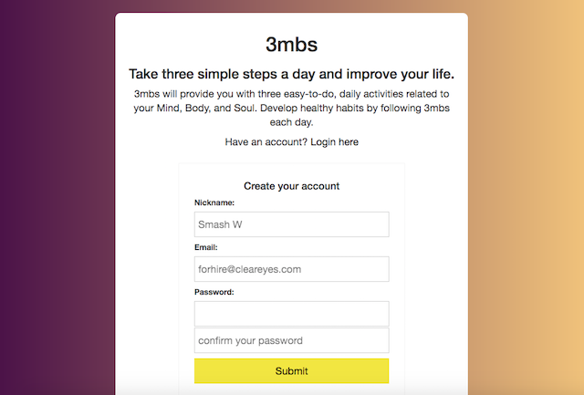
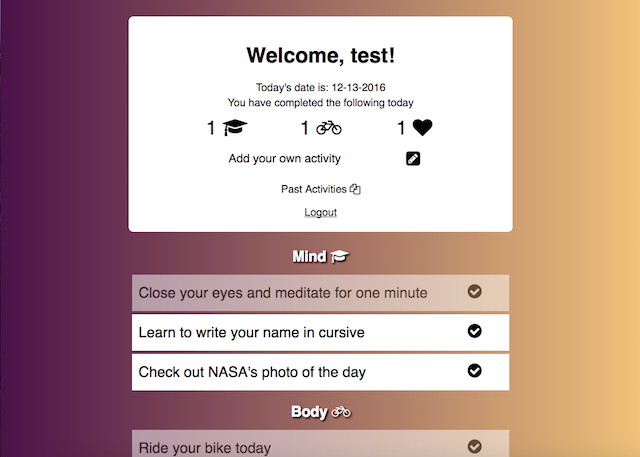

# 3mbs

Live site: https://glacial-cove-28448.herokuapp.com/

3mbs is a daily activity reminder to help you live a healthier, happier lifestyle.

# Usage

The site provides users a selection of easy-to-do activities that enhance your mind, body, and soul each day. Users are first prompted to create his/her own site profile. Users have the option to sign in via Facebook or Google.

As users log in to the site, a set of daily activities specific for the day will be generated at random and displayed for all users logged in. A user can mark off completed activities and the number and type of activity completed will be saved on his/her profile. 

Users can submit his/her own activities, which will then become part of the collections of daily activities for the site to generate. Users can also view a log of his/her past activity completions.

# Technology

- This site uses HTML, CSS, and EJS templates to present its contents on a responsive and dynamic front-end display.
- Node.js and Express are utilized to handle the back-end interface, creating request endpoints, handling routes, and sending response data to the front-end templates. 
- Profile creation and authentication occurs through Passport-Local, Passport-Fackbook, and Passport-Google strategies, and the Connect-Flash module is used to display signup or login errors such as incorrect password entry. The bcryptjs module is used in tandem with Passport to secure each user's password.
- User profiles, submitted content, and daily activities are saved, generated, and retrieved with MongoDB and Mongoose.
- The two static activities (NASA's photo of the day and Youtube's workout video) are retrieved through ajax calls on the server, utilizing the Unirest module.

